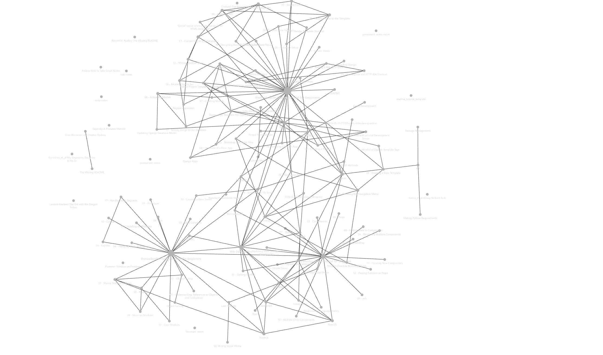

# README - Technical Notes

A collection and repository of all technical notes to reference and locate/recall where I gained/learned a factoid or insight.

Using obsidian to manage note creation and note-link referencing : <https://obsidian.md/>

[Note Taking Workflow](_inbox/Note%20Taking%20Workflow.md)

## Areas of Interest

- [Game Development](Game%20Development.md)
- [Programming Languages](Programming%20Languages.md)
- [Web Development](Web%20Development.md)
- [Raspberry Pi](Raspberry%20Pi.md)

## [Tutorials and Guides](tutorials-and-guides/README.md)

Online instructions and walkthroughs via an article or videos

## Note Ideas

1. Django - what's the difference between Templates and Views
2. What is the difference between a compiler and a transpiler?

## Blogs/Inspiration

- [Maxime Cote](https://www.maximecote.me/)

## Resources

- [SourceMaking](https://sourcemaking.com/) : I will tell you a lot of stories about good software architecture and teach you how to create it with design patterns. I will guide you through anti-patterns, common pitfalls and mistakes that people make when they plan, create, and manage software projects. In the end, I will teach you
  how to smell a bad code and improve it with refactoring.

- [Solarian Programmer - My programming ramblings](https://solarianprogrammer.com/)
- [Software Carpentry - Teaching basic lab skills for resarch computing](https://software-carpentry.org/)

## Projects Backlog

- [A Dungeon Master With A Thermal Printer | Hackaday](https://hackaday.com/2022/12/24/a-dungeon-master-with-a-thermal-printer/)
- [Penpal Recordkeeper](project-ideas/Penpal%20Recordkeeper.md)

