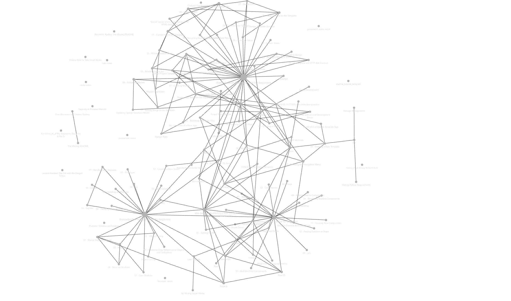

---
aliases:
  - ROOT README
  - MAIN README
  - README - Technical Notes
note-type: readme
---

# README - Technical Notes

A central hub for organizing and finding technical notes, and to track personal growth;
thus, serving as a reference to easily recall where I acquired specific facts or insights.

Using obsidian to manage note creation and note-link referencing : <https://obsidian.md/>

[Note Taking Workflow Draft](_inbox/Note%20Taking%20Workflow%20Draft.md)

[Books I'm currently reading](book-note-reference-hub/README.md)

[Tech Talks](4-hub-notes-🚉/Tech%20Talks.md)

[Career and Personal Development](4-hub-notes-🚉/Career%20and%20Personal%20Development.md)

## SacState: Courses Enrolled Spring 2024

- [CSC 196P - Cloud and Mobile Pragmatics](tutorials-guides-and-online-courses/CSC%20196P%20-%20Cloud%20and%20Mobile%20Pragmatics/README.md)
- [Math 100 - Applied Linear Algebra](tutorials-guides-and-online-courses/Math%20100%20-%20Applied%20Linear%20Algebra/README.md)

## Areas of Interest

- [Game Development](4-hub-notes-🚉/Game%20Development.md)
- [Hardware](4-hub-notes-🚉/Hardware.md)
- [Linux](4-hub-notes-🚉/Linux.md)
- [Programming Languages](4-hub-notes-🚉/Programming%20Languages.md)
- [Raspberry Pi](4-hub-notes-🚉/Raspberry%20Pi.md)
- [Web Development](4-hub-notes-🚉/Web%20Development.md)
- [Android Development](4-hub-notes-🚉/Android%20Development.md)

## [Tutorials, Guides, and Online Courses](tutorials-guides-and-online-courses/README.md)

Online instructions and walkthroughs via an article or videos

- [Introduction To Computer Science And Programming In Python](https://ocw.mit.edu/courses/6-0001-introduction-to-computer-science-and-programming-in-python-fall-2016/) - can do on your own
- [MITx: Introduction to Computer Science and Programming Using Python](https://www.edx.org/learn/computer-science/massachusetts-institute-of-technology-introduction-to-computer-science-and-programming-using-python?index=product&queryID=3420e438ac2d916d1f5c8f3486fc69a0&position=1&results_level=first-level-results&term=introduction+to+computer+science+mit&objectID=course-956319ec-8665-4039-8bc6-32c9a9aea5e9&campaign=Introduction+to+Computer+Science+and+Programming+Using+Python&source=edX&product_category=course&placement_url=https%3A%2F%2Fwww.edx.org%2Fsearch)

## Note Ideas

1. Django - what's the difference between Templates and Views
2. What is the difference between a compiler and a transpiler?
3. What is the difference between "Bandwidth" and "throughput"

## Miscellaneous

- [Blogs and Inspiration](4-hub-notes-🚉/Blogs%20and%20Inspiration.md)

- [A Dungeon Master With A Thermal Printer | Hackaday](https://hackaday.com/2022/12/24/a-dungeon-master-with-a-thermal-printer/)
- [Penpal Recordkeeper](project-ideas/Penpal%20Recordkeeper.md)
- [Printing with Pi Raspberry Pi Thermal Printer Fun](https://diyodemag.com/projects/printing_with_pi_raspberry_pi_thermal_printer_fun)
