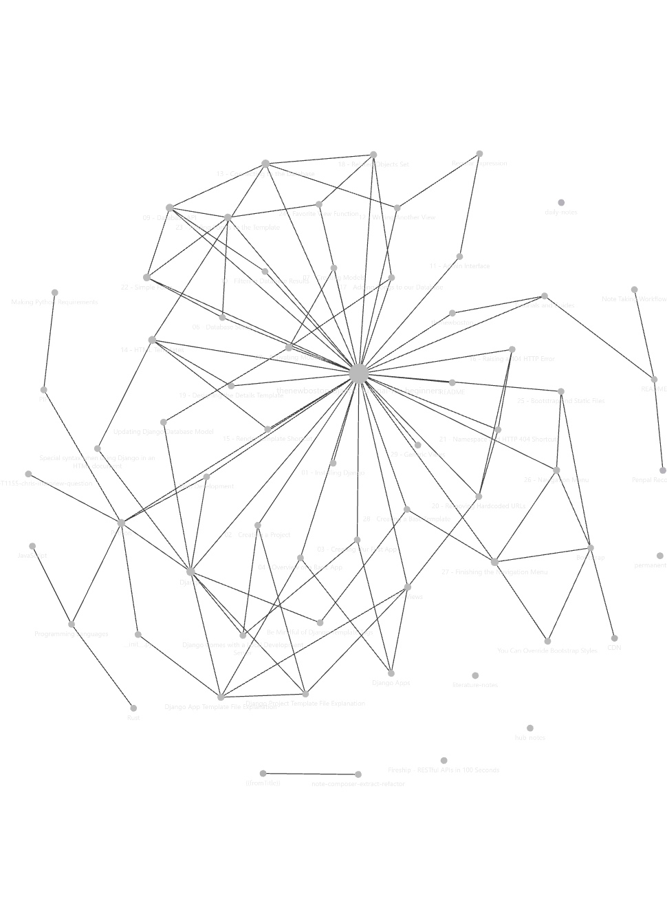

# Technical Notes

A collection and repository of all technical notes to reference and locate/recall where I gained/learned a factoid or insight.

Using obsidian to manage note creation and note-link referencing : <https://obsidian.md/>

[Note Taking Workflow](_inbox/Note%20Taking%20Workflow.md)

## [Tutorials and Guides](tutorials-and-guides/Tutorials%20and%20Guides.md)

Online instructions and walkthroughs via an article or videos

## Note Ideas

1. Django - what's the difference between Templates and Views
2. What is the difference between a compiler and a transpiler?

## Blogs/Inspiration

- [Maxime Cote](https://www.maximecote.me/)

## Courses, Tutorials, and New Learnings Backlog

- [Introduction to Internet of Things, XEE100, Stanford School of Engineering](https://online.stanford.edu/courses/xee100-introduction-internet-things)
- [React Tutorial: Tic-Tac-Toe](https://react.dev/learn/tutorial-tic-tac-toe)
- [The Unix Shell - Summary and Setup](https://swcarpentry.github.io/shell-novice/)
- [Tyler Smart](https://github.com/tjsmart) recommends [anthonywritescode](https://www.youtube.com/@anthonywritescode) for coding on YouTube - Functools Cache: [python: functools.lru_cache (beginner - intermediate) anthony explains #54 - YouTube](https://www.youtube.com/watch?v=K0Q5twtYxWY)
- [Tyler Smart](https://github.com/tjsmart) recommends [Sphinx](https://pypi.org/project/Sphinx/) for documentation
- [Neovim for Beginners — Source Code Control : Explore plugins for source code control and other interesting plugins](https://alpha2phi.medium.com/neovim-for-beginners-source-code-control-71139e4513a1)
- [Watch "Avoid endless if-else statements with this Python Tip!!" on YouTube](https://youtube.com/shorts/UFdEp9wrtOY?feature=share)

## Resources

- [SourceMaking](https://sourcemaking.com/) : I will tell you a lot of stories about good software architecture and teach you how to create it with design patterns. I will guide you through anti-patterns, common pitfalls and mistakes that people make when they plan, create, and manage software projects. In the end, I will teach you
  how to smell a bad code and improve it with refactoring.

- [Solarian Programmer - My programming ramblings](https://solarianprogrammer.com/)
- [Software Carpentry - Teaching basic lab skills for resarch computing](https://software-carpentry.org/)

## Projects Backlog

- [A Dungeon Master With A Thermal Printer | Hackaday](https://hackaday.com/2022/12/24/a-dungeon-master-with-a-thermal-printer/)
- [Penpal Recordkeeper](project-ideas/Penpal%20Recordkeeper.md)

