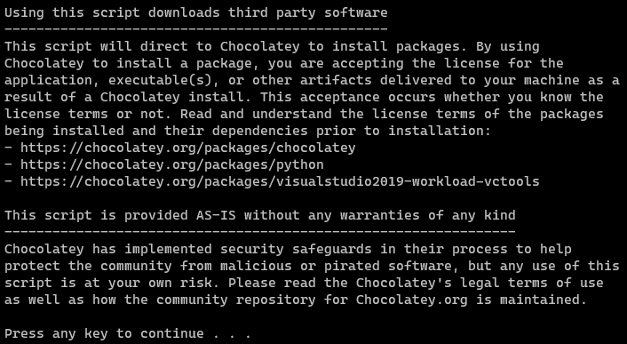

# 01 - Installing on Windows

Week 30.6 | Saturday, July 29, 2023 | 07:20 PM

Related : [thenewboston-nodejs-tutorial-for-beginners](thenewboston-nodejs-tutorial-for-beginners.md)

Source : [Node.js Tutorial for Beginners - 1 - Installing on Windows](https://www.youtube.com/watch?v=-u-j7uqU7sI&list=PL6gx4Cwl9DGBMdkKFn3HasZnnAqVjzHn_)

When making Node.js applications the framework will look for `app.js` first and run it.

## Installation notes for on Windows

Node.js is used to make server side applications like chat programs, games, and websites.

Node.js is useful for real-time applications.

1. [Node.js homepage](https://nodejs.org/en)
   1. On download gives you a `.msi` file (basically an install wizard)
2. Validate installation type `node`
   1. If it does not give you the Node.js shell restart your machine.
      you should get an output prompt similar to "Welcome to Node.js v18.17.0."
3. In the shell you can type `console.log("bacon");` and it should output the text (`bacon`) and it's value `undefined`

thenewboston suggest using [JetBrains's](https://www.jetbrains.com/) [WebStorm (The smartest JavaScript IDE)](https://www.jetbrains.com/webstorm/)

I'll be using Microsoft's [VS Code](https://code.visualstudio.com/).

Debug/run code in a browser versus just within the terminal

- This can be done via the debug and selecting "Launch Chrome against localhost"

```json
//.vscode > launch.json
{
  // Use IntelliSense to learn about possible attributes.
  // Hover to view descriptions of existing attributes.
  // For more information, visit: https://go.microsoft.com/fwlink/?linkid=830387
  "version": "0.2.0",
  "configurations": [
    {
      "type": "chrome",
      "request": "launch",
      "name": "Launch Chrome against localhost",
      "url": "http://localhost:8080",
      "webRoot": "${workspaceFolder}"
    }
  ]
}
```

## Additional outputs and extra stuff when installing




```
Upgraded:
 - python v3.11.4
 - python3 v3.11.4
 - visualstudio2019-workload-vctools v1.0.1
 - chocolatey-visualstudio.extension v1.11.0
 - visualstudio2019buildtools v16.11.28.0
 - python311 v3.11.4
 - visualstudio-installer v2.0.3
```
